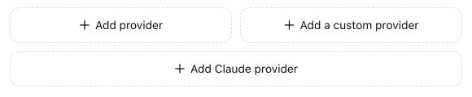
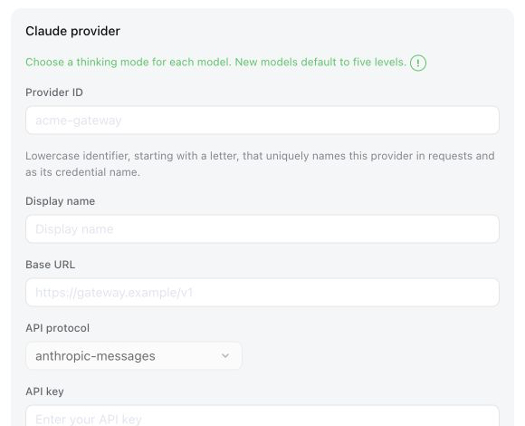
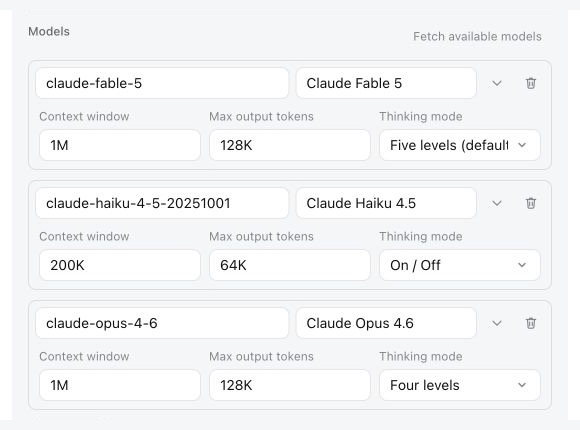

# DSH Claude Provider

English | [简体中文](./README.zh-CN.md)

DSH Claude Provider adds a dedicated Claude configuration interface to DeepSeek Harness. You can add multiple Claude providers, choose reasoning levels for each model, and automatically fetch model lists and fill in capacity settings and reasoning presets for common Claude models, without editing `settings.yaml` manually.

Compared with the official generic custom provider form, the plugin adds a dedicated Claude entry, five-level, four-level, and on/off reasoning presets, and automatic defaults for known Claude models. DeepSeek Harness handles the saved reasoning configuration natively.

## What this plugin does

1. **Adds a dedicated Claude provider type**

   The Models settings page gains a separate **Claude Provider** form.

<p align="center">
  
</p>

   Selecting **Add Claude Provider** opens the dedicated Anthropic Messages form:

<p align="center">
  
</p>

2. **Adds model-specific reasoning modes**

   Each model can use one of three configurable mode sets:

   - Five levels: Low, Medium, High, XHigh, and Max
   - Four levels: Low, Medium, High, and Max
   - Toggle: On or Off

   New models default to five levels, and Claude providers default to High.

   On save, the plugin writes each model's reasoning levels and adaptive thinking settings to DeepSeek Harness's native configuration.

<p align="center">
  
</p>

3. **Supports paginated Anthropic model discovery**

   The plugin fetches model lists through an Anthropic-compatible `GET /v1/models` endpoint, follows the returned cursors to retrieve subsequent pages, and deduplicates the results.

4. **Fills known Claude model defaults after discovery**

   When a discovered model matches a recorded Claude model ID, the plugin automatically fills its context window, maximum output length, and reasoning-mode set. Models entered manually remain fully editable and are not overwritten by this lookup.

5. **Leaves every other provider unchanged**

   Discovery, defaults, and reasoning controls are limited to Provider IDs explicitly created as **Claude Providers**. DeepSeek Harness's built-in providers and ordinary custom providers keep their original behavior, even when they use `anthropic-messages` or expose a `claude-*` model ID.

## Install

### Published package

For the browser interface, install the plugin into the Web profile:

```sh
npx @deepseek-ai/dsh plugin --profile web add @mofeng2223/dsh-claude-provider
```

Restart the corresponding DeepSeek Harness process after installation.

### From source

Clone, build, and package the repository first:

```sh
git clone https://github.com/MoFeng2223/dsh-claude-provider.git
cd dsh-claude-provider
npm install
npm run build
mkdir -p dist
npm pack --pack-destination dist
```

Install the generated package into the Web profile:

```sh
npx @deepseek-ai/dsh plugin --profile web add ./dist/mofeng2223-dsh-claude-provider-*.tgz
```

## Uninstall

```sh
npx @deepseek-ai/dsh plugin --profile web remove @mofeng2223/dsh-claude-provider
```

Uninstalling the plugin does not delete `~/.dsh/settings.yaml` or stored credentials. Existing Claude providers remain ordinary custom `anthropic-messages` providers, and their saved reasoning levels and adaptive thinking settings remain effective. The dedicated Claude add/edit interface, paginated model discovery, and automatic defaults are no longer available; the official model discovery feature remains available.

## License

[MIT](./LICENSE)
