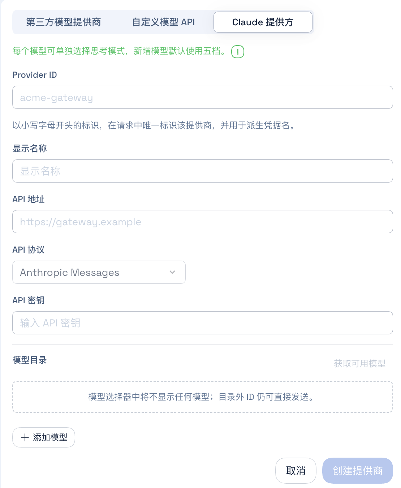
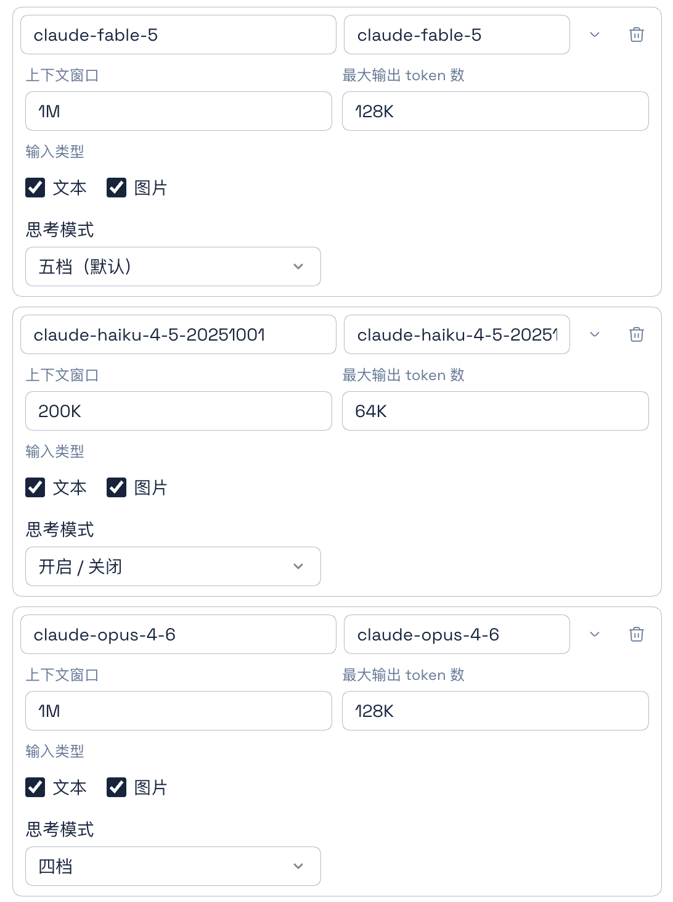

# DSH Claude Provider

[English](./README.md) | 简体中文

DSH Claude Provider 为 DeepSeek Harness 提供专用的 Claude 配置界面。你可以添加多个 Claude 提供方，为每个模型选择推理档位，并自动获取模型列表、填写常用 Claude 模型的容量和推理预设，无需手动编辑配置文件。

相比官方的通用自定义提供方配置，插件增加了独立的 Claude 入口、五档／四档／开关式推理预设，以及按已知 Claude 模型自动填写参数的功能。保存后的推理配置由 DeepSeek Harness 原生处理。

## 插件功能

1. **增加独立的 Claude 提供方类型**

   在「设置 → 模型 → 添加模型提供商」中选择「Claude 提供方」，即可打开专用的 Anthropic Messages 配置表单。

<p align="center">
  
</p>

2. **增加按模型设置的推理模式**

   每个模型可以单独选择以下三种档位配置之一：

   - 五档：Low、Medium、High、XHigh、Max
   - 四档：Low、Medium、High、Max
   - 开关：On、Off

   新增模型默认使用五档，Claude 提供方默认选择 High。

   插件会在保存时将模型的推理档位和自适应思考设置写入 DeepSeek Harness 原生配置。

<p align="center">
  
</p>

3. **支持 Anthropic 模型列表分页获取**

   插件通过 Anthropic 兼容的 `GET /v1/models` 接口获取模型列表，并根据接口返回的游标继续读取后续页面、合并重复模型。

4. **探测后自动填写常用 Claude 模型参数**

   探测到的模型 ID 如果与插件已经记录的 Claude 模型匹配，插件会自动填写上下文窗口、最大输出长度和推理模式。用户手动添加的模型仍然可以自由编辑，不会被这项自动匹配覆盖。

5. **不影响其他提供方**

   模型探测、参数预填和推理档位配置只对明确创建为“Claude 提供方”的 Provider ID 生效。DeepSeek Harness 的内置提供方和普通自定义提供方会保持原有行为，即使它们同样使用 `anthropic-messages` 协议，或者包含 `claude-*` 模型 ID，也不会被插件修改。

## 安装

### 安装已发布的版本

浏览器界面使用 Web Profile：

```sh
npx @deepseek-ai/dsh plugin --profile web add @mofeng2223/dsh-claude-provider
```

安装后需要重启对应的 DeepSeek Harness 进程。

### 从源码安装

先克隆、构建并打包项目：

```sh
git clone https://github.com/MoFeng2223/dsh-claude-provider.git
cd dsh-claude-provider
npm install
npm run build
mkdir -p dist
npm pack --pack-destination dist
```

将生成的包安装到 Web Profile：

```sh
npx @deepseek-ai/dsh plugin --profile web add ./dist/mofeng2223-dsh-claude-provider-*.tgz
```

## 卸载

```sh
npx @deepseek-ai/dsh plugin --profile web remove @mofeng2223/dsh-claude-provider
```

卸载插件不会删除官方模型配置或已经保存的凭据。已有的 Claude 提供方会继续作为普通的 `anthropic-messages` 自定义提供方保留，已保存的推理档位和自适应思考配置仍然有效。卸载后将不再提供 Claude 专用的添加／编辑界面、分页模型探测和参数预填；官方的模型探测功能仍然可用。

## DSH 0.1.7 升级与配置迁移

本版本适配 DSH 0.1.7-alpha.2。

### 1. 尚未安装新版 DSH

先关闭 DSH，升级 DSH 和 Claude 插件，再启动 DSH。新版 DSH 首次启动时，会尝试将旧 `settings.yaml` 迁移到当前 Profile。

### 2. 已安装新版 DSH，但尚未运行

此时尚未触发配置迁移。先更新 Claude 插件及其他需要适配的插件，再启动 DSH。新版 DSH 首次启动时，会尝试迁移旧 Settings 配置。

### 3. 已安装并运行过新版 DSH

此时 Settings 已经由 DSH 执行过自动迁移，部分配置可能存在迁移问题。

对本插件而言，可能的影响只有 Claude 提供方类型标记丢失，**模型配置和运行不受影响**。

## 许可证

[MIT](./LICENSE)
