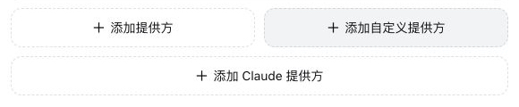
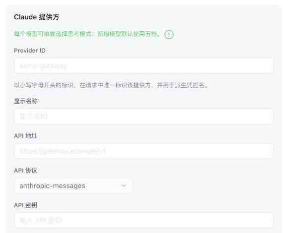
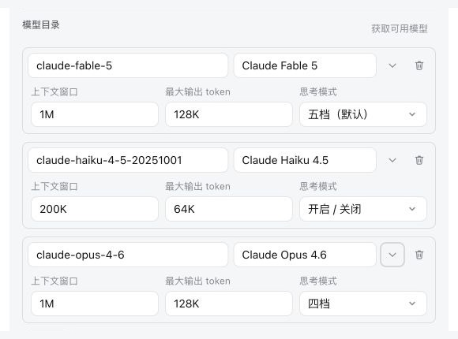

# DSH Claude Provider

[English](./README.md) | 简体中文

~~DeepSeek Harness 的通用推理强度控制与新版 Claude 模型要求的请求参数并不完全匹配，因此选择某个档位后，可能直接出现 HTTP 400，也可能被适配器静默映射成另一个实际档位，例如界面选择 Max，实际请求却只相当于 High。`@mofeng2223/dsh-claude-provider` 增加了一个明确的 Claude 提供方类型，并按照每个 Claude 模型的配置发送正确的推理参数。~~

DeepSeek Harness 0.1.0-rc.8 已支持 Claude 系列模型的推理强度参数，但仍需要在 `settings.yaml` 中手动配置。因此，本插件不再在运行时拦截或改写模型请求，而是在用户通过前端保存 Claude 提供方时，将相应的原生配置正确写入 `settings.yaml`。

插件仍保留专用的 Claude 提供方配置页面，用户无需手动编辑 `settings.yaml`。Anthropic 原生模型探测、常用 Claude 模型参数自动填写等官方尚未实现的功能也继续保留。

## 插件功能

1. **增加独立的 Claude 提供方类型**

   模型设置页面会增加单独的“Claude 提供方”表单。你可以在这个类型下创建多个 Provider ID，不会与普通自定义提供方混在一起。

<p align="center">
  
</p>

   点击“添加 Claude 提供方”后，会打开独立的 Anthropic Messages 配置表单：

<p align="center">
  
</p>

2. **增加按模型设置的推理模式**

   每个模型可以单独选择以下三种档位配置之一：

   - 五档：Low、Medium、High、XHigh、Max
   - 四档：Low、Medium、High、Max
   - 开关：On、Off

   新增模型默认使用五档，Claude 提供方默认选择 High。

   ~~对于 adaptive thinking 模型，插件会把所选档位转换成 Claude 使用的 `thinking.type: adaptive` 与 `output_config.effort` 请求格式，避免适配器拒绝请求或把档位降级。~~

   对于 adaptive thinking 模型，插件会在保存时将所选档位写入 dsh 原生配置。

<p align="center">
  
</p>

3. **补充 Anthropic 原生模型探测**

   DeepSeek Harness 的普通自定义提供方在使用 `anthropic-messages` 协议时无法获取模型列表。本插件为 Claude 提供方增加了基于 Anthropic 兼容 `GET /v1/models` 接口的模型探测，并支持游标分页。

4. **探测后自动填写常用 Claude 模型参数**

   探测到的模型 ID 如果与插件已经记录的 Claude 模型匹配，插件会自动填写上下文窗口、最大输出长度和推理模式。用户手动添加的模型仍然可以自由编辑，不会被这项自动匹配覆盖。

5. **使用 RC8 原生配置，不改写请求**

   模型探测、参数预填和推理档位只对明确创建为“Claude 提供方”的 Provider ID 生效。保存后的提供方仍是标准 `llm-pi-ai` 路由；插件不会替换全局 `fetch`，也不会修改 RC8 的模型适配器。

## 安装

### 安装已发布的版本

浏览器界面使用 Web Profile：

```sh
npx @deepseek-ai/dsh plugin --profile web add @mofeng2223/dsh-claude-provider
```

不使用 Web 界面的命令行运行使用 Headless Profile：

```sh
npx @deepseek-ai/dsh plugin --profile headless add @mofeng2223/dsh-claude-provider
```

安装后需要重启对应的 DeepSeek Harness 进程。

### 从源码安装

先克隆、构建并打包项目：

```sh
git clone https://github.com/MoFeng2223/dsh-claude-provider.git
cd dsh-claude-provider
npm install
npm run build
mkdir -p dist
npm pack --pack-destination dist
```

将生成的包安装到 Web Profile：

```sh
npx @deepseek-ai/dsh plugin --profile web add ./dist/mofeng2223-dsh-claude-provider-*.tgz
```

或者安装到 Headless Profile：

```sh
npx @deepseek-ai/dsh plugin --profile headless add ./dist/mofeng2223-dsh-claude-provider-*.tgz
```

## 卸载

插件安装在哪个 Profile，就执行对应的卸载命令：

```sh
npx @deepseek-ai/dsh plugin --profile web remove @mofeng2223/dsh-claude-provider
npx @deepseek-ai/dsh plugin --profile headless remove @mofeng2223/dsh-claude-provider
```

卸载插件不会删除 `~/.dsh/settings.yaml` 或已经保存的凭据。已有的 Claude 提供方会继续作为普通的 `anthropic-messages` 自定义路由保留；`reasoningEfforts`、默认 `reasoning` 和 `compat.forceAdaptiveThinking` 都是 RC8 原生字段，因此自适应思考和前端推理等级选择仍然有效。卸载后只会失去 Claude 专用的添加／编辑界面、模型探测和参数预填。

## 许可证

[MIT](./LICENSE)
